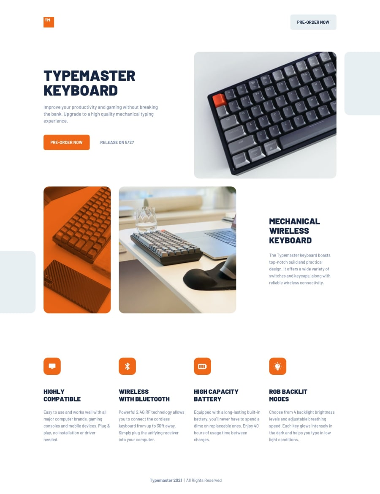
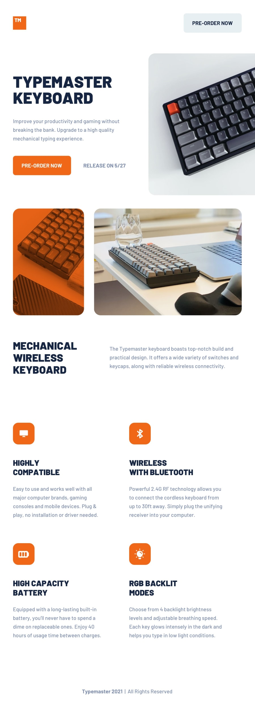
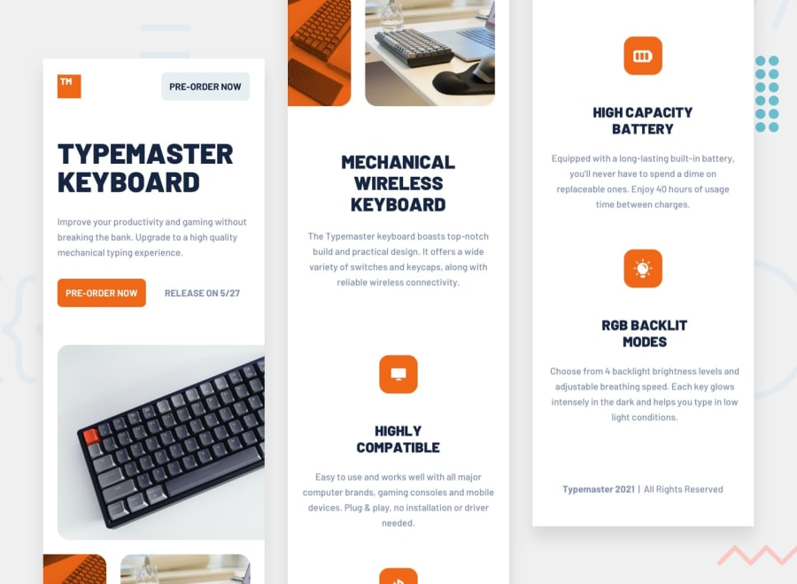

## Description
This is a self-built app in Next.js. I started with a HTML/CSS project challenge from Frontend Mentor. In order to make the content dynamic I converted to Next.js and I implemented a headless CMS. This way the user can fill in their own content. I'm currently working on adding a typing game to show I can work with interactions and state.  

### [Check the deployed version here](https://type-master-nextjs.vercel.app/) 

## Learning Goals
- To practise for myself
- Learn more about Next.js
- Learn more about CSS and responsiveness design
- Implement a webpage according to Figma design (trying to be pixel perfect 😄)
- Learn more about headless CMS (contenful)

## Technologies used
- HTML
- CSS
- React
- Next.js
- Figma
- Contentful

## Screenshots of the design
Make it clear what I was trying to make it look like. Here are some screenshots of the original design:

### Desktop

### Tablet

### Mobile

